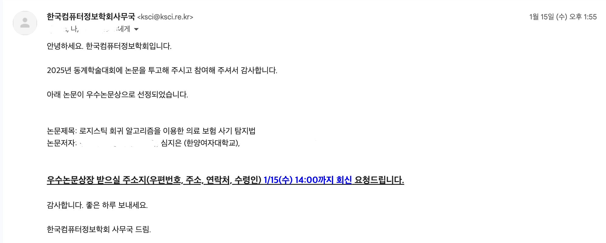

# 로지스틱 회귀를 이용한 의료보험 사기탐지 🔍

## 1. 목표 및 프로젝트 기간 

### 1.1 목표 👍🏻
- 보험청구 과정에서 발생하는 사기 행위 근절 
- 보험사의 재정손실 예방 
- 정직한 가입자의 보험료 상승 방지 
- 사기 탐지의 자동화 
- 보험 시스템 신뢰도 상승

### 1.2 프로젝트 기간 ⏳
#### Dec 2024 - Jan 2025 

## 2. 개발 환경 및 개발 방법 👩🏻‍💻
### 2.1 개발 환경
- Jupyter Notebook 
  - colab

### 2.2 데이터셋 
- https://www.kaggle.com/datasets/nyashachizampeni/medical-insurance-claim-fraud
- 14개의 독립변수와 1개의 종속변수(사기여부)
- 결측치 없음

### 2.3 데이터 전처리
- One-hot encoding 활용
  - 성별, 사고 원인과 같은 범주형 변수를 수치형 변수로 변환
- 환자의 생년월일 데이터를 age 데이터로 변환 (나이 데이터를 새로 만들어 추후에 연령대별 사기 비율을 알 수 있도록 함)
- 표준화와 정규화
  - 데이터 분포 조정을 통해 특정 독립변수가 다른 독립변수의 비해 지나치게 큰 값을 가지는 문제를 해결 
- 차원축소 (주성분 분석, 선형 판별 분석)
  - 주성분 분석 : 데이터 분산이 가장 큰 축을 찾아 그 방향으로 차원을 축소
  - 선형 판별 분석 : 클래스 간 분리를 최대화하면서 데이터 차원을 감소

### 2.4 모델 생성 
- 하이퍼파라미터 튜닝 : GridSearchCV로 대략적인 최적값을 찾은 후 수동 조정을 통해 더 정밀한 튜닝 과정을 진행 
  - GridSearchCV
    - 장점 : 사전 정의된 하이퍼파라미터 범위를 탐색해 최적의 조합을 자동 탐색
    - 단점 : 계산 비용 높아져 훈련시간 증가
  - 수동 조정

## 3. 모델 성능 및 평가 
### 3.1 모델 정확도 및 재현율 
- 정확도 88% 재현율 92%

### 3.2 평가 
- 아쉬운 정확도
  - 모델 정확도는 약 88%로, 실제 보험 사기 탐지 시스템에 적용하기에는 다소 아쉬운 수준
  - 이러한 정확도의 주요 원인은 데이터셋의 제한된 특성과 데이터셋 불균형으로 인해 실제 보험 사기 사례를 충분히 반영하지 못했을 가능성이 있음
  - 구조적 사기 패턴을 파악하기 위한 추가 데이터를 확보해야할 필요가 있음

### 3.3 향후 연구 방향 

1. 최신 최적화 기법 도입
  현재 gridsearchCV 기반 하이퍼파라미터 튜닝은 시간 소모적이며 효율성 면에서 한계적이므로, 이를 개선하기 위해 최신 최적화 기법을 도입해 모델 성능을 향상시킬 계획
2. 데이터 확장을 통한 종합적인 데이터셋 구축
  보험 청구 데이터뿐만 아니라 보험 사기에 연루된 의사 및 의료기관에 대한 정보를 포함하는 종합적인 데이터셋을 구축할 계획
3. flask 애플리케이션을 확장
  클라우드 기반 플랫폼으로 전환, 대규모 데이터 처리와 실시간 응답속도를 개선하는 방향
    
## 4. 사용자 인터페이스 설계 
### Flask 프레임 워크를 활용한 웹 애플리케이션 구현
- 청구 데이터를 입력 받아 사기 가능성을 실시간으로 예측하는 기능을 제공
- 보험사의 사기 탐지 프로세스를 간소화
- 데이터 분석 결과를 신속히 제공함으로써 실무에서의 효율성 증대

⬆️ 데이터 값 입력 화면 

⬆️ 사기탐지 결과 화면

## 5. 성과 📝
### 71차 한국컴퓨터정보학회 동계학술대회 2024 우수논문 수상 및 발표 

